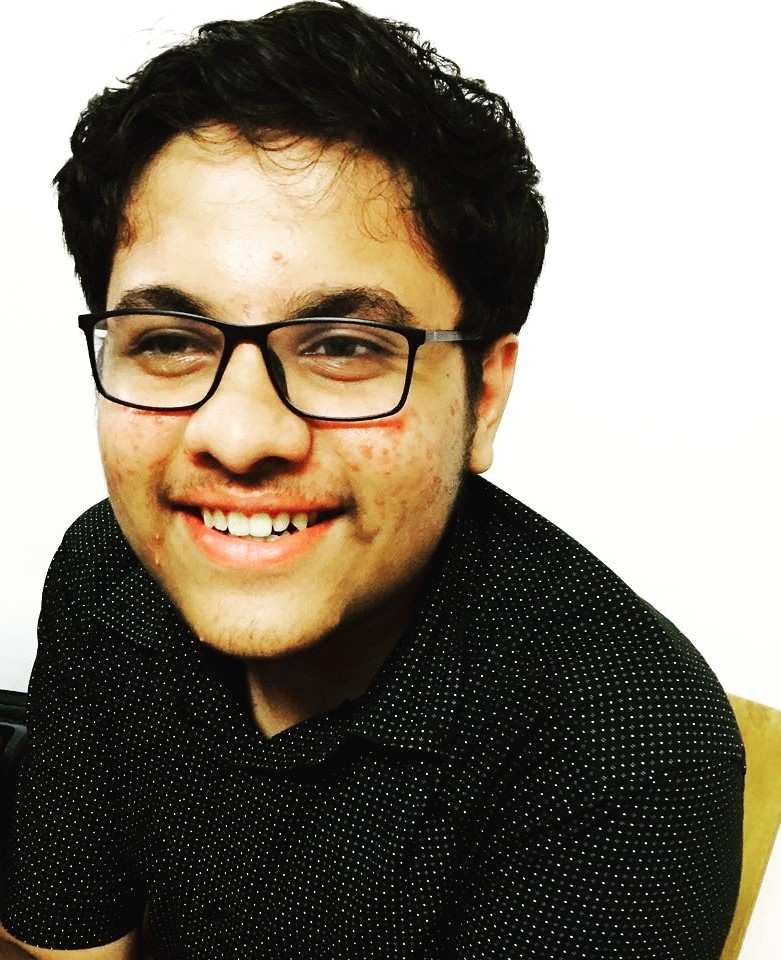

# Welcome 
### I'm Anurag Natoo 

## About Me 
CS Undergrad , Front-end developer

I was born and brought up in Hyderabad.
I studied from first grade to tenth grade in The Mother's Integral School , Hyderabad.
I completed my 11th and 12th grade in Sri Chaitanya Jr. Kalasala,DD Colony Hyderabad.
After securing a good rank in JEE Mains 2017 , currently I'm a Computer Science Student at IIITDM Kancheepuram.

I'm a Sophomore learning and implementing a lot of stuff. Currently I'm working as a 
Front-end Developer at [Digital Media Team, IIITDM Kancheepuram](https://github.com/DMT-IIITDM).
Languages I know are C and Java. Web technologies I've used are HTML, CSS and JavaScript.

I'm a huge fan of The Marvel Cinematic Universe and Harry Potter. I love to play chess and watch cricket.
I watch a lot of movies and get inspired by some.

## Contact Me- 
#### [GITHUB](https://github.com/anuragnatoo)
